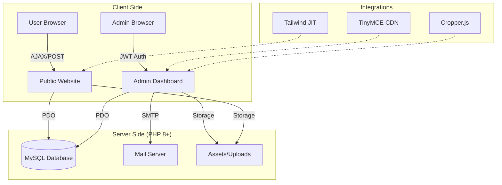

# 🌍 AskMe Tour & Travel
> **A Premium, End-to-End Travel Management & Registration Platform**


AskMe is a high-performance, aesthetically driven web application designed for modern tour and travel agencies. It seamlessly blends a stunning user experience with a powerful administrative infrastructure, enabling immersive storytelling, dynamic event management, and secure registration workflows.

---

## ✨ Key Features

### 🛳️ For Travelers
- **Immersive Exploration**: High-fidelity carousels and glassmorphic UI elements for discovering Ethiopia and global destinations.
- **Dynamic Event Registration**: A multi-step, asynchronous registration system with real-time file upload progress and validation.
- **Custom Trip Builder**: Tailored application forms for bespoke travel experiences.
- **Rich Content**: Detailed itineraries, high-resolution galleries, and integrated client testimonials.
- **Real-time Notifications**: Automated, branded HTML confirmation emails for every registration.

### 🔐 For Administrators (Admin 2.0)
- **Global Rich Text Control**: Integrated **TinyMCE 6** across all modules for professional content formatting.
- **Interactive Image Studio**: Built-in **Cropper.js** for precise image framing (Banners, Profiles, Thumbnails) before upload.
- **Engagement Center**: Direct "Reply-to-Inbox" capability and a professional **Newsletter Broadcast** system.
- **Data Mastery**: Comprehensive dashboard for managing Events, Packages, Destinations, Team Members, and Subscribers.
- **Secure Infrastructure**: JWT-based authentication and secure SMTP integration via environmental variables.

---

## 🛠️ Technology Stack

| Layer | Technologies |
| :--- | :--- |
| **Frontend** |    |
| **Backend** |   |
| **Database** |  |
| **Libraries** | **TinyMCE 6**, **Cropper.js**, **FontAwesome 6**, **Google Fonts (Outfit)** |

---

## 🏗️ Architecture



---

## 🛡️ Security & Performance

- **XSS Protection**: Comprehensive sanitization using `htmlspecialchars` on all dynamic output.
- **SQL Injection Prevention**: 100% adherence to **PDO Prepared Statements**.
- **Environmental Security**: Sensitive SMTP and Admin credentials managed via `.env` files.
- **Optimized Assets**: Modern layout using Tailwind's utility-first approach for minimal CSS bloat.
- **Asynchronous Workflows**: AJAX-based form submissions to ensure zero page reloads during registration.

---

## 🚀 Installation & Setup

### 1. Prerequisites
- PHP 7.4 or higher
- MySQL 5.7+
- Composer (Optional)

### 2. Deployment
```bash
# 1. Clone the repository
git clone https://github.com/aelaf/AskMe_Website.git

# 2. Configure Environment
cp .env.example .env
# Edit .env with your SMTP and Database credentials

# 3. Database Setup
# Import database.sql into your MySQL instance
```

### 3. Folder Structure
```text
├── admin/            # Dashboard & Content Management
├── api/              # Async Endpoints (Newsletter, Auth)
├── assets/           # Design Tokens, Images, CSS/JS
├── includes/         # Core Utilities (DB, Mailer, JWT)
├── pages/            # Public Views (Events, Packages)
└── uploads/          # User & Admin Uploaded Documents
```

---

## 📬 Contact & Support

**AskMe Tour & Travel**  
📍 Addis Ababa, Ethiopia  
📧 [info@askmetour.org](mailto:info@askmetour.org)  
🌐 [www.askmetour.org](http://www.askmetour.org)

---
> [!TIP]
> **Admin Credentials**: Access the dashboard at `/admin`. Use the credentials defined in your `.env` file.
